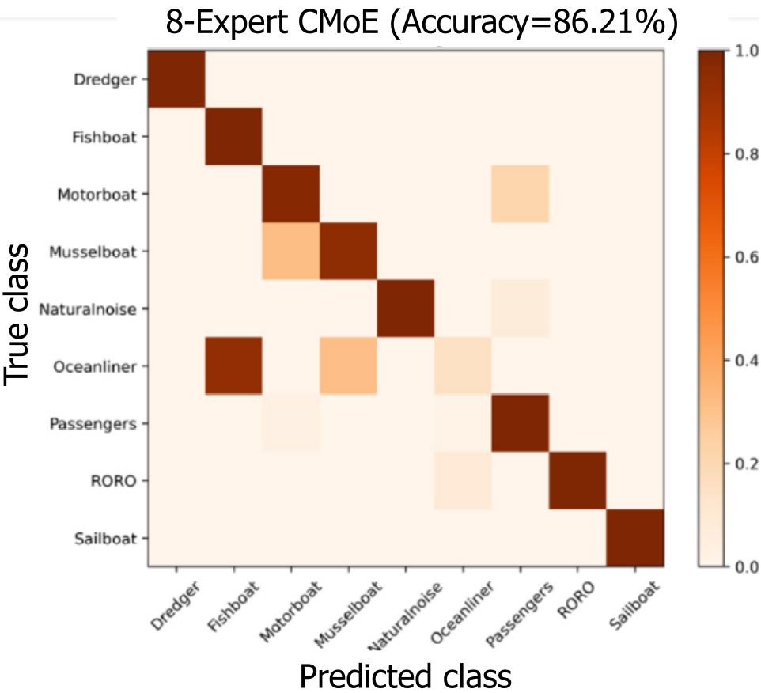

# UATR-CMoE
### Underwater acoustic target recognition -- Convolution-based Mixture of Experts

This is the PyTorch implementation of the paper:   
**"Unraveling Complex Data Diversity in Underwater Acoustic Target Recognition through Convolution-based Mixture of Experts"**,      
which has been published on **Expert Systems with Applications**.     

**DOI: https://doi.org/10.1016/j.eswa.2024.123431**      
**Arxiv: https://arxiv.org/abs/2402.11919**   

 

    
    

 

        
In addition to the model architecture (cmoe_model.py), this repository offers pre-extracted features of the Shipsear test set, accompanied by corresponding testing code.

## Steps of Inference

