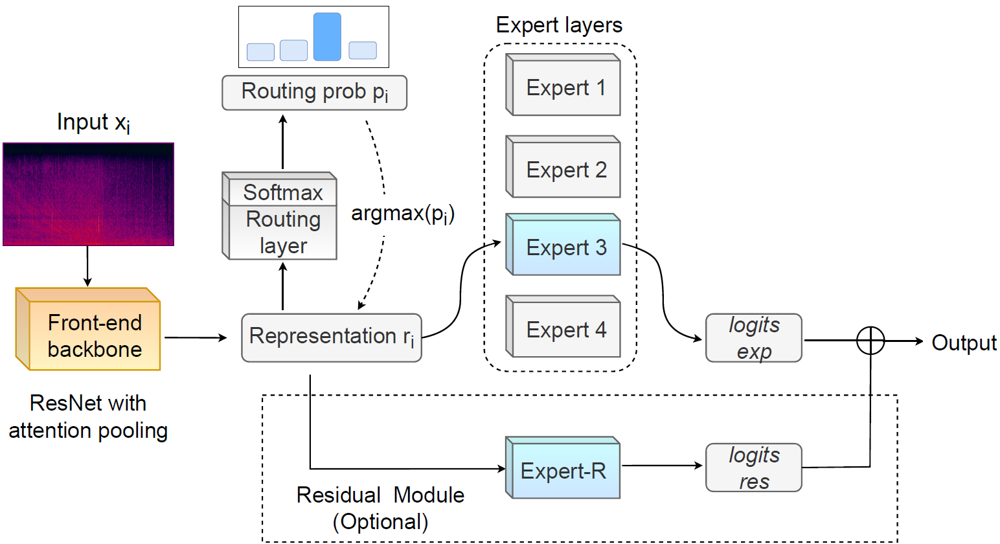

# UATR-CMoE
### Underwater acoustic target recognition -- Convolution-based Mixture of Experts


This is the PyTorch implementation of the paper:   
**"Unraveling Complex Data Diversity in Underwater Acoustic Target Recognition through Convolution-based Mixture of Experts"**,      
which has been published on **Expert Systems with Applications**.     

**DOI: https://doi.org/10.1016/j.eswa.2024.123431**      
**Arxiv: https://arxiv.org/abs/2402.11919**   

<br/>

<div style="display: flex; justify-content: space-between;">
    
    
</div>

<br/>

        
In addition to the model architecture **(cmoe_model.py)**, this repository offers pre-extracted features of the Shipsear test set, accompanied by corresponding testing code.


## Steps of Inference
```
git clone https://github.com/xy980523/UATR-CMoE.git    
cd UATR-CMoE
pip install -r requirements.txt
```


#### 1. Download pre-extracted features and pre-trained checkpoint  
Download link:    
Pre-extracted features: https://github.com/xy980523/UATR-CMoE/releases/download/features/features.zip
Pre-trained checkpoint: https://github.com/xy980523/UATR-CMoE/releases/download/checkpoint/best_model.ckpt   

Save features to your own path (/path_features):   
```
mkdir -p /path_features
unzip features.zip -d /path_features
``
And make sure ``best_model.ckpt'' is in the UATR-CMoE folder.

#### 2. Load models and print results

```
python test.py /path_features
```
It will produce the accuracy and confusion matrix on the Shipsear test set.

#### 3. (Optional) Reproduce the confusion matrix   

```
python draw_confusion.py
```
It will produce the confusion matrix heat map (see Fig. 5 in the paper).

## Citation

```
@article{xie2024unraveling,
  title={Unraveling complex data diversity in underwater acoustic target recognition through convolution-based mixture of experts},
  author={Xie, Yuan and Ren, Jiawei and Xu, Ji},
  journal={Expert Systems with Applications},
  pages={123431},
  year={2024},
  publisher={Elsevier}
}
```


